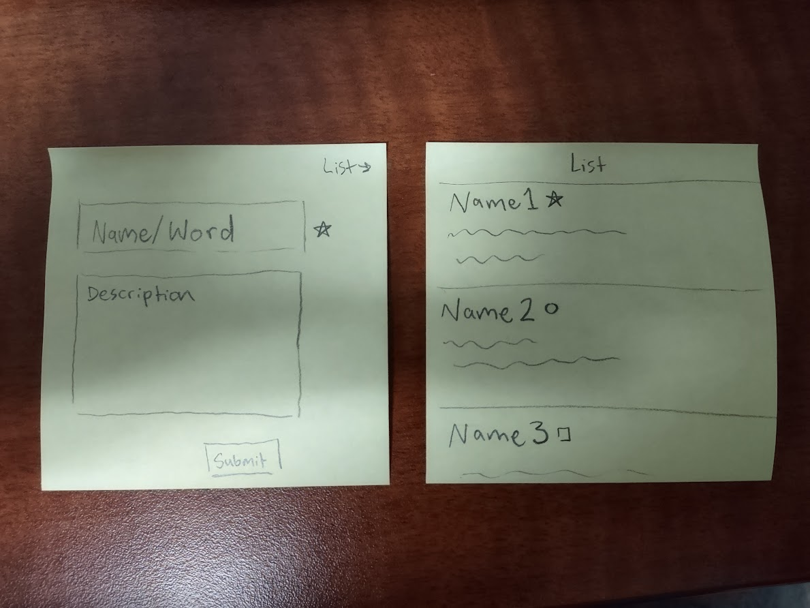

# startup
## About
This is an app for name nerds and vocab buffs alike.
Just add a word, write a description, and choose an icon, save it to your list, and you're good to go. Parents looking for baby names, creators looking to name characters, and people who just like learning and remembering new words will all be glad to have this on hand. 



Key Features:
- Login
- Type out word and description
- Save to personal list
- Others are notified of newly saved names/words
- View list of your previously saved words

## Learning Notes
The VS Code merge editor is useful. You can choose to accept changes from one side or the other, or both, or neither.

IP:
3.138.248.88

SSH Command:
ssh -i cs260/cs260.pem ubuntu@3.138.248.88


### HTML
```html
<!-- commented text -->
```

| element   | meaning                                                                |
| --------- | ---------------------------------------------------------------------- |
| `html`    | The page container                                                     |
| `head`    | Header information                                                     |
| `title`   | Title of the page                                                      |
| `meta`    | Metadata for the page such as character set or viewport settings       |
| `script`  | JavaScript reference. Either a external reference, or inline           |
| `include` | External content reference                                             |
| `body`    | The entire content body of the page                                    |
| `header`  | Header of the main content                                             |
| `footer`  | Footer of the main content                                             |
| `nav`     | Navigational inputs                                                    |
| `main`    | Main content of the page                                               |
| `section` | A section of the main content                                          |
| `aside`   | Aside content from the main content                                    |
| `div`     | A block division of content                                            |
| `span`    | An inline span of content                                              |
| `h<1-9>`  | Text heading. From h1, the highest level, down to h9, the lowest level |
| `p`       | A paragraph of text                                                    |
| `b`       | Bring attention                                                        |
| `table`   | Table                                                                  |
| `tr`      | Table row                                                              |
| `th`      | Table header                                                           |
| `td`      | Table data                                                             |
| `ol,ul`   | Ordered or unordered list                                              |
| `li`      | List item                                                              |
| `a`       | Anchor the text to a hyperlink                                         |
| `img`     | Graphical image reference                                              |
| `dialog`  | Interactive component such as a confirmation                           |
| `form`    | A collection of user input                                             |
| `input`   | User input field                                                       |
| `audio`   | Audio content                                                          |
| `video`   | Video content                                                          |
| `svg`     | Scalable vector graphic content                                        |
| `iframe`  | Inline frame of another HTML page                                      |

(The HTML: Input CodePen has good examples of all the different input types, but here's how radio buttons work:
<label for="radio1">radio1</label>
<input type="radio" id="radio1" name="varRadio" value="radio1" checked />
<label for="radio2">radio2</label>
<input type="radio" id="radio2" name="varRadio" value="radio2" checked />

### CSS
`div span { ... }`  
any span that is a child of a div will be styled
